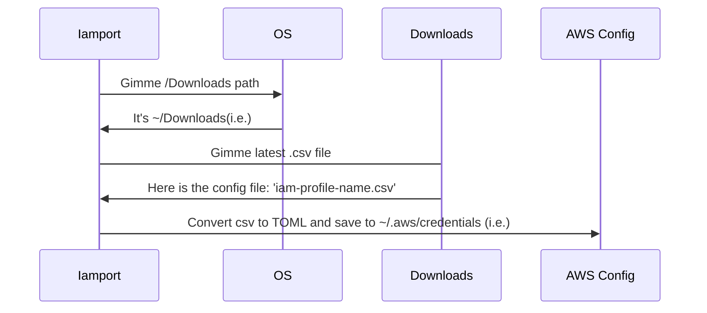

# Import with Iamport

**Iamport** works no matter your operating system is; Import your external configurations and credentials without extra manual work. It has been built to import AWS IAM configuration by latest downloaded CSV file but should and will be cloud agnostic.

# Installation

    git clone https://github.com/ugurcemozturk/iamport
    pip install -r requirements.txt

# Usage

Simply import your new IAM user credentials from **the latest downloaded CSV** to AWS config file, assumed at home folder, **~/.aws/credentials**
 

    iamport aws

# TO-DO

 - [ ] Add Azure
 - [ ] Add GCP
 - [ ] Override csv path by parameter
 - [ ] Override .aws config path by parameter
 - [ ] Option for file writing, just print to console

## Flow

